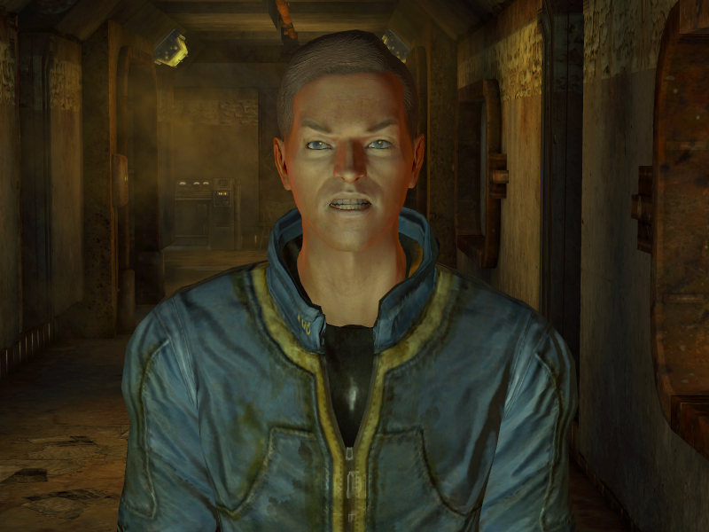

## GaryOS

### Writing my own kernel for learning purposes and shit

#### Usefull Sources

http://www.ctyme.com/rbrown.htm

https://wiki.osdev.org/

________________

#### FAT16 support only

_"Yo mama's so FAT she can't save files bigger than 4GB"_